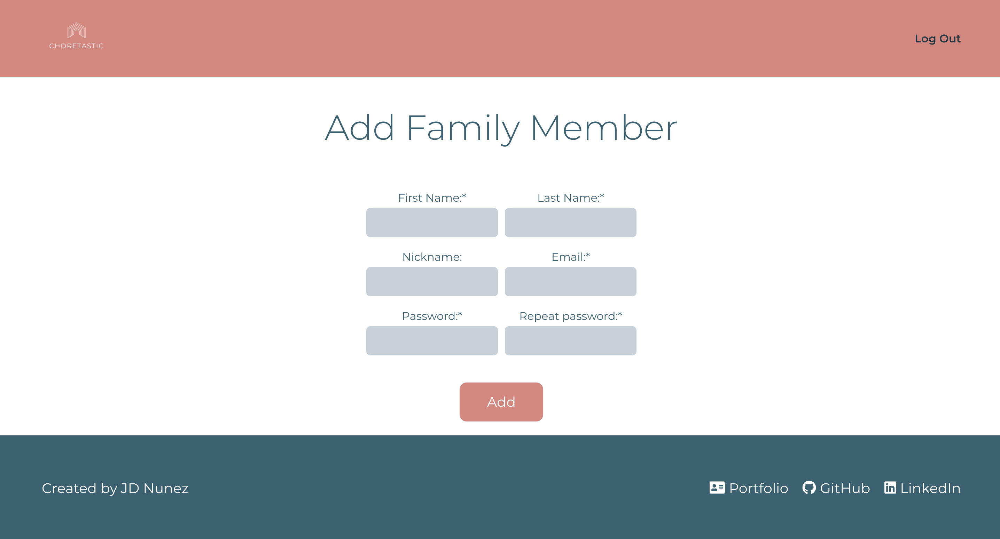
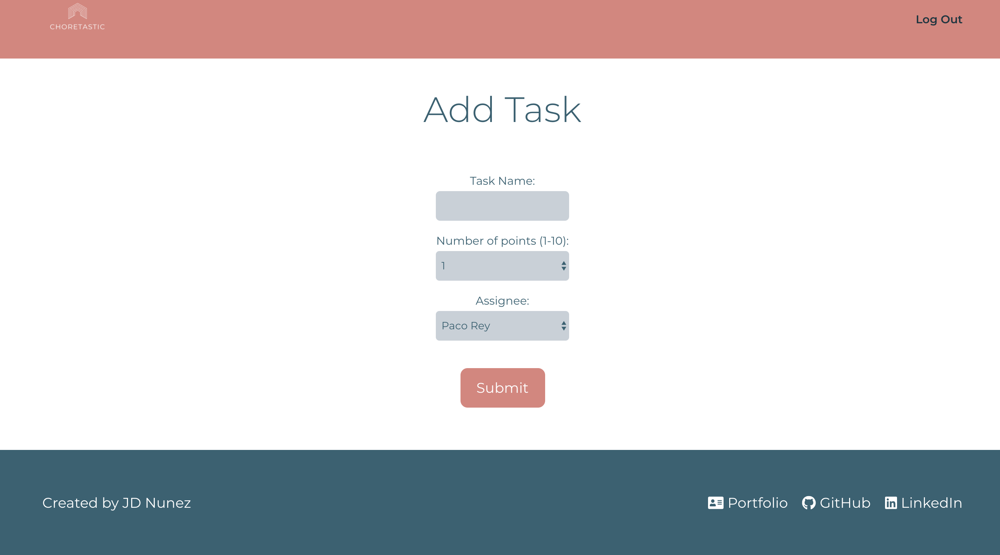

# Choretastic

This project was bootstrapped with [Create React App](https://github.com/facebook/create-react-app).

## Summary

Choretastic is a web app that allows users to organize their household's chores among members of their family. Each task will confer a certain number of points to the user who completes it.
There will be a scoreboard with each user's points ordered from highest to lowest.

## Demo

In order to test a demo account, use the following log in credentials:
**Email:** jd@choretastic.com
**Password:** jd-password

### Instuctions

1. Run the app in development mode with 'npm start.'
2. In the landing page, click 'Sign In.'

3. Enter the demo credentials.

4. You'll land on My Tasks. This will list all your assigned tasks.

5. All Tasks will list all your family's tasks.

6. Scoreboard will list your family's current points.

7. In order to add a new family member, click 'Scoreboard' and then 'Add Family Member.'

8. In order to add a new task, click 'My Tasks' or 'All Tasks' and then 'Add Task.'

## Available Scripts

In the project directory, you can run:

### `npm start`

Runs the app in the development mode. 
Open [http://localhost:3000](http://localhost:3000) to view it in the browser.

The page will reload if you make edits. 
You will also see any lint errors in the console.

### `npm test`

Launches the test runner in the interactive watch mode. 
See the section about [running tests](https://facebook.github.io/create-react-app/docs/running-tests) for more information.

### `npm run build`

Builds the app for production to the `build` folder. 
It correctly bundles React in production mode and optimizes the build for the best performance.

The build is minified and the filenames include the hashes. 
Your app is ready to be deployed!

See the section about [deployment](https://facebook.github.io/create-react-app/docs/deployment) for more information.

### `npm run eject`

**Note: this is a one-way operation. Once you `eject`, you can’t go back!**

If you aren’t satisfied with the build tool and configuration choices, you can `eject` at any time. This command will remove the single build dependency from your project.

Instead, it will copy all the configuration files and the transitive dependencies (webpack, Babel, ESLint, etc) right into your project so you have full control over them. All of the commands except `eject` will still work, but they will point to the copied scripts so you can tweak them. At this point you’re on your own.

You don’t have to ever use `eject`. The curated feature set is suitable for small and middle deployments, and you shouldn’t feel obligated to use this feature. However we understand that this tool wouldn’t be useful if you couldn’t customize it when you are ready for it.

## Technologies Used

**Frontend:** React, CSS 
**Backend:** Node, Express, PostgreSQL

## Learn More

You can learn more in the [Create React App documentation](https://facebook.github.io/create-react-app/docs/getting-started).

To learn React, check out the [React documentation](https://reactjs.org/).

### Code Splitting

This section has moved here: https://facebook.github.io/create-react-app/docs/code-splitting

### Analyzing the Bundle Size

This section has moved here: https://facebook.github.io/create-react-app/docs/analyzing-the-bundle-size

### Making a Progressive Web App

This section has moved here: https://facebook.github.io/create-react-app/docs/making-a-progressive-web-app

### Advanced Configuration

This section has moved here: https://facebook.github.io/create-react-app/docs/advanced-configuration

### Deployment

This section has moved here: https://facebook.github.io/create-react-app/docs/deployment

### `npm run build` fails to minify

This section has moved here: https://facebook.github.io/create-react-app/docs/troubleshooting#npm-run-build-fails-to-minify
# choretastic-app
